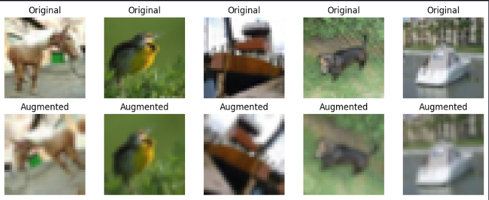
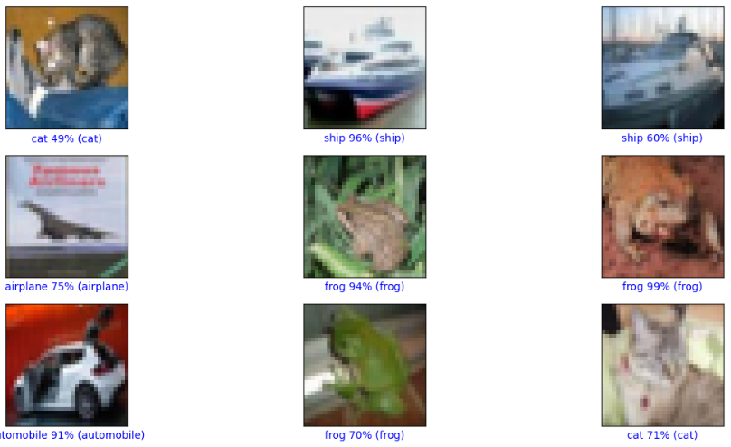
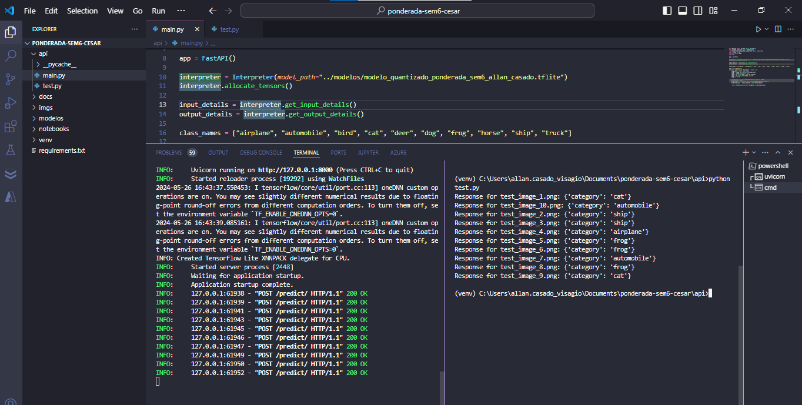

# Relatório da Ponderada de Classificação de Imagens CIFAR-10

Este relatório detalha o desenvolvimento de uma CNN para classificar imagens do dataset CIFAR-10 e a implementação de uma API FastAPI que utiliza o modelo quantizado após o treinamento para fazer inferências. O projeto envolve o uso de técnicas como data augmentation, dropout, e early stopping para otimizar o desempenho do modelo. Após o treino, o modelo é disponibilizado através de uma API para classificação em tempo real.

# 1. Desenvolvimento do Modelo de Classificação

## 1.1 Importação das Bibliotecas e Preparação dos Dados
O notebook de treino do modelo começa com a importação das bibliotecas TensorFlow, NumPy, e Matplotlib. Utiliza-se o dataset CIFAR-10, que é pré-carregado do TensorFlow Keras e normalizado. O OneHotEncoding é aplicado em cima dos rótulos.

## 1.2 Data Augmentation
Implementa-se data augmentation diretamente na pipeline de treinamento do modelo usando o próprio Tensorflow. Isso inclui rotações, zoom e flips horizontais para aumentar a robustez do modelo contra variações nas imagens de entrada.

Abaixo seguem algumas imagens aumentadas, de exemplo.

## 1.3 Arquitetura do Modelo
O modelo utiliza camadas convolucionais intercaladas com ativações ReLU e max pooling, seguidas de camadas de dropout para reduzir o overfitting (essa técnica funciona descartando aleatoriamente uma proporção especificada de unidades de ativação em cada camada durante o treinamento, forçando o modelo a aprender representações mais generalizáveis). A arquitetura finaliza com camadas densas para a classificação das dez categorias do CIFAR-10.

## 1.4 Treinamento do Modelo
O modelo é compilado com a função de perda categorical_crossentropy e o otimizador adam, monitorando a métrica de accuracy para avaliar o desempenho. Utilizamos a técnica de Early Stopping para prevenir o overfitting, interrompendo o treinamento se a val_loss não melhorar após 10 épocas consecutiva. Passando o parâmetro restore_best_weights=True, garantimos que o modelo retorna os pesos que produziram a menor perda de nos dados de validação. O treinamento é efetuado com um split de validação de 20%. O treinamento ocorreu durante 51 épocas.

## 1.5 Resultados do Treinamento

#### 1.5.1 Gráficos da acurácia e da perda ao longo das épocas

#### 1.5.2 Acurácia final nos dados de teste

#### 1.5.3 Exemplos de inferências realizadas vs categorias reais

## 1.6 Salvamento e Quantização do Modelo

O modelo foi salvo no formato .h5 para facilitar o reuso, aproveitando a eficiência do formato HDF5 em armazenar grandes volumes de dados. Além disso, o modelo foi quantizado usando TensorFlow Lite para reduzir o tamanho do arquivo e acelerar a inferência. A quantização transforma os dados do modelo de 32 bits de precisão para 8 bits, diminuindo a carga de armazenamento e processamento.

A quantização do modelo resultou em uma redução significativa do tamanho do arquivo quando comparada à versão original salva em formato .h5. O arquivo original .h5 possui 4,244 KB, enquanto a versão quantizada em formato TensorFlow Lite (TFLite) tem apenas 359 KB. Isso representa uma diminuição substancial no tamanho, tornando o modelo quantizado cerca de 92% menor que o seu equivalente não quantizado. 

# 2. API para Inferência

## 2.1 Desenvolvimento com FastAPI

A API foi desenvolvida utilizando FastAPI, um framework python bem utilizado no contexto de machine learning. Foi criada uma rota para realizar a predição de uma imagem de input, com o modelo treinado. O output é um JSON com a categoria prevista da imagem de input.

## 2.2 Carregamento e Uso do Modelo Quantizado

O modelo quantizado, armazenado como .tflite, foi carregado na inicialização da API utilizando o Interpreter do TensorFlow Lite. Durante a inferência, a imagem recebida é transformada e normalizada antes de ser submetida ao modelo, que retorna a classificação da imagem.

## 2.3 Formato de Resposta da API

A API devolve um JSON contendo a categoria prevista pelo modelo, como "airplane", "automobile", etc.
Exemplo: {"category": "airplane"}

## 2.4 Testes

Foi desenvolvido um script de teste em python para fazer o envio de imagens de teste para a API através de requisições POST. O código desenvolvido passa pela pasta "../imgs/", selecionando as imagens em formato PNG para serem enviadas à API. Cada imagem é enviada, e a resposta da API é exibida, junto com a própria imagem.

Na imagem abaixo, observamos na janela do terminal à esquerda a API desenvolvida em FastAPI em execução, processando requisições POST. À direita, no terminal, são exibidos os resultados das requisições enviadas para a API, destacando as categorias previstas para as imagens armazenadas na pasta "../imgs/". Esta visualização demonstra a funcionalidade da API em classificar imagens em tempo real.

