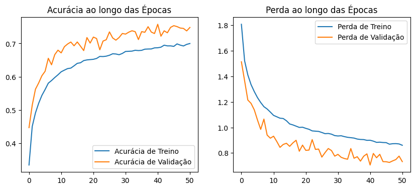
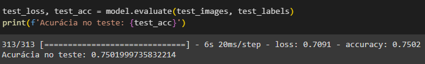

# Relatório da Ponderada de Classificação de Imagens CIFAR-10

Este relatório detalha o desenvolvimento de uma CNN para classificar imagens do dataset CIFAR-10 e a implementação de uma API FastAPI que utiliza o modelo quantizado após o treinamento para fazer inferências. O projeto envolve o uso de técnicas como data augmentation, dropout, e early stopping para otimizar o desempenho do modelo. Após o treino, o modelo é disponibilizado através de uma API para classificação em tempo real.

# 1. Desenvolvimento do Modelo de Classificação

## 1.1 Importação das Bibliotecas e Preparação dos Dados
O notebook de treino do modelo começa com a importação das bibliotecas TensorFlow, NumPy, e Matplotlib. Utiliza-se o dataset CIFAR-10, que é pré-carregado do TensorFlow Keras e normalizado. O OneHotEncoding é aplicado em cima dos rótulos.

## 1.2 Data Augmentation
Implementa-se data augmentation diretamente na pipeline de treinamento do modelo usando o próprio Tensorflow. Isso inclui rotações, zoom e flips horizontais para aumentar a robustez do modelo contra variações nas imagens de entrada.

## 1.3 Arquitetura do Modelo
O modelo utiliza camadas convolucionais intercaladas com ativações ReLU e max pooling, seguidas de camadas de dropout para reduzir o overfitting (essa técnica funciona descartando aleatoriamente uma proporção especificada de unidades de ativação em cada camada durante o treinamento, forçando o modelo a aprender representações mais generalizáveis). A arquitetura finaliza com camadas densas para a classificação das dez categorias do CIFAR-10.

## 1.4 Treinamento do Modelo
O modelo é compilado com a função de perda categorical_crossentropy e o otimizador adam, monitorando a métrica de accuracy para avaliar o desempenho. Utilizamos a técnica de Early Stopping para prevenir o overfitting, interrompendo o treinamento se a val_loss não melhorar após 10 épocas consecutiva. Passando o parâmetro restore_best_weights=True, garantimos que o modelo retorna os pesos que produziram a menor perda de nos dados de validação. O treinamento é efetuado com um split de validação de 20%. O treinamento ocorreu durante 51 épocas.

## 1.5 Resultados do Treinamento

#### 1.5.1 Gráficos da acurácia e da perda ao longo das épocas

#### 1.5.2 Acurácia final nos dados de teste

